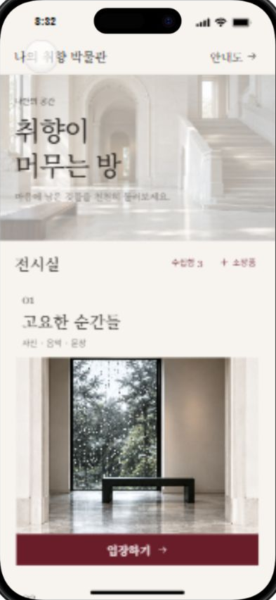

# 나의 취향 박물관

사진, 문장, 링크처럼 마음에 남은 것들을 전시실에 모아 둘러보는 개인 박물관입니다. 국립중앙박물관·메트로폴리탄·루브르의 차분한 전시 경험에서 영감을 받아, 로비의 입구와 평면 안내도로 전시실을 탐색합니다.

이 프로젝트는 **로그인 없는 1인용 웹**입니다. 미니 PC에서 이미 운영 중인 Nginx·Node.js 컨테이너에 연결하고, 휴대전화와 PC의 브라우저는 Tailscale 사설 네트워크를 통해 박물관에 접속합니다. 소장품 원본과 데이터는 GitHub가 아니라 Node.js 컨테이너에 연결된 영속 볼륨에 저장됩니다.

### 빠른 이동

- [사람을 위한 안내](#사람을-위한-안내)
- [LLM / 코딩 에이전트용 컨텍스트](#llm--코딩-에이전트용-컨텍스트)
- [에이전트 설치 가이드](#에이전트-설치-가이드)

## 사람을 위한 안내

### 할 수 있는 일

- 로비에서 전시실 입구를 선택해 입장하기
- 평면 안내도에서 방을 선택하고 크게 보기
- 사진·문장·HTTP(S) 링크를 수집함에 저장하기
- 사진을 미니 PC에 업로드하고 제목·메모·문장·링크·전시실을 수정하기
- 저장한 소장품을 삭제하거나 다른 전시실로 옮기기
- SQLite와 업로드 파일을 날짜별로 백업하고 복원하기
- iPhone / Pixel 10 미리보기에서 모바일 화면과 키보드 동작 확인하기

| 전시실 | 주제 |
| --- | --- |
| 01 고요한 순간들 | 사진, 음악, 문장 |
| 02 언젠가의 공간 | 공간, 가구, 생활의 온도 |
| 03 오래 곁에 둔 것들 | 물건과 기억을 위한 하이라이트 |
| 04 아직 이름 없는 취향 | 이유를 몰라도 좋아하는 것들 |

기본 소장품과 이미지는 체험용 예시입니다. 음악 예시는 실제 음원을 재생하지 않습니다. 예시 소장품은 삭제·편집되지 않으며, 새로 저장한 소장품만 서버 데이터로 관리됩니다.

### 로컬에서 실행하기

Node.js 24와 npm을 준비한 뒤 저장소 루트에서 실행합니다.

~~~sh
npm ci
npm run build
npm start
~~~

브라우저에서 http://127.0.0.1:8080 을 엽니다. <code>npm run dev -- --host 127.0.0.1 --port 5187</code>은 화면 작업용 Vite 미리보기이며, API 서버가 없어 업로드와 영구 저장은 동작하지 않습니다.

로컬 데이터는 기본적으로 <code>server/data/</code>에 만들어집니다. 이 폴더는 Git에 올라가지 않습니다.

### 기존 컨테이너 환경에 배포하기

이 저장소는 **Nginx와 Node.js 컨테이너가 이미 운영 중인 환경**에 앱을 연결하는 것을 기본으로 합니다. 저장소에서 Docker 엔진, Nginx, Node.js, Tailscale을 설치하지 않습니다. Tailscale은 호스트 또는 별도 네트워크 컨테이너에서 사설 네트워크 연결만 담당합니다.

#### 컨테이너 계약

- **Nginx 컨테이너**: 외부 80/443 포트를 공개하고 `dist/client/`를 읽기 전용으로 마운트합니다. `/api/*`와 `/uploads/*`는 Node.js 컨테이너로 전달합니다.
- **Node.js 컨테이너**: 저장소의 `server/`와 빌드 결과를 사용할 수 있어야 하며 `0.0.0.0:8080`에서 실행합니다. `MUSEUM_DATA_DIR`를 영속 볼륨에 연결합니다.
- **컨테이너 네트워크**: 두 컨테이너가 같은 내부 네트워크에 있어야 합니다. Nginx 템플릿의 `museum-api:8080`에서 `museum-api`는 실제 Node.js 서비스명으로 바꿉니다.
- **데이터 볼륨**: SQLite와 `uploads/`는 이미지나 컨테이너 레이어에 넣지 않고 영속 볼륨에 둡니다.

#### 1. 빌드 결과 준비

빌드는 기존 CI, 작업 호스트 또는 Node.js 컨테이너에서 수행할 수 있습니다. 중요한 결과물은 Nginx 컨테이너에 마운트할 `dist/client/`입니다.

~~~sh
git clone https://github.com/esin3329/taste-museum.git
cd taste-museum
npm ci
npm run build
test -f dist/client/index.html
~~~

`dist/client/`를 Nginx 컨테이너의 `/usr/share/nginx/html`에 읽기 전용으로 마운트하거나 이미지 빌드 단계에서 복사합니다.

#### 2. Node.js 컨테이너 환경 변수

Node.js 컨테이너에는 다음 값을 적용합니다. 컨테이너 밖의 경로가 아니라 컨테이너 안의 마운트 경로를 사용합니다.

~~~text
NODE_ENV=production
HOST=0.0.0.0
PORT=8080
MUSEUM_DATA_DIR=/var/lib/taste-museum
~~~

실행 명령은 `npm start`이며, 컨테이너의 `/var/lib/taste-museum`에는 SQLite와 `uploads/`가 계속 남는 영속 볼륨을 연결합니다. Node.js 컨테이너 안에서 `curl http://127.0.0.1:8080/api/health`가 `{"ok":true}`를 반환해야 합니다.

#### 3. Nginx 컨테이너 연결

설정 템플릿은 [server/nginx/taste-museum.conf](server/nginx/taste-museum.conf)입니다. Nginx 컨테이너의 설정 디렉터리에 읽기 전용으로 마운트하고, `root`는 `/usr/share/nginx/html`을 유지합니다. 별도 Node.js 컨테이너를 사용하면 `museum-api:8080`을 실제 서비스명으로 바꿉니다. 같은 컨테이너에서 두 프로세스를 실행하는 경우에만 `127.0.0.1:8080`을 사용합니다.

Nginx 컨테이너에서 `nginx -t`와 reload를 실행한 뒤, Nginx가 공개한 포트에서 `/api/health`를 확인합니다. 이 저장소의 프론트엔드는 같은 origin의 `/api`와 `/uploads`를 호출하므로 별도 CORS 설정이 필요하지 않습니다.

#### 4. Tailscale 네트워크 연결

Tailscale이 연결된 기기에서 Nginx 컨테이너가 공개한 포트로 접속합니다. 예를 들어 미니 PC의 Tailscale IP가 `100.73.115.1`이고 Nginx가 80번 포트를 공개하면 `http://100.73.115.1/`을 엽니다. HTTPS는 기존 리버스 프록시의 인증서 설정을 사용합니다. `tailscale serve`나 Funnel은 사용하지 않습니다.

외부에 직접 공개할 필요가 없으면 호스트 방화벽과 Tailscale ACL에서 Nginx 포트만 허용합니다. Node.js 컨테이너의 8080 포트는 호스트에 공개하지 않고 내부 컨테이너 네트워크에서만 접근하게 합니다.

#### 5. 백업·복원과 업데이트

백업은 기존 스케줄러 또는 별도 작업 컨테이너가 Node.js 이미지 안의 `scripts/backup.mjs`를 실행하도록 연결합니다. `MUSEUM_DATA_DIR`와 `MUSEUM_BACKUP_DIR` 모두 영속 볼륨을 사용하고, 복원 전에는 Node.js 컨테이너를 중지합니다. 컨테이너를 교체해도 데이터 볼륨은 삭제하지 않습니다.

업데이트 순서는 다음과 같습니다.

1. 새 소스를 받아 `npm ci`와 `npm run build`를 실행합니다.
2. 새 `dist/client/`를 Nginx 컨테이너에 마운트하거나 이미지에 복사합니다.
3. Node.js 컨테이너를 새 이미지 또는 새 소스로 재시작합니다.
4. Nginx를 reload하고 `/api/health`와 업로드 흐름을 확인합니다.

컨테이너 이름, 볼륨 이름, 이미지 빌드 방식은 기존 운영 환경을 유지하고, 이 저장소에서는 위의 경로와 환경 변수 계약만 지킵니다.

#### 6. 접속 확인

1. Tailscale이 연결된 PC에서 Nginx의 Tailscale 주소를 엽니다.
2. 휴대전화에서 Tailscale을 켜고 같은 주소에 접속합니다.
3. 로비 → 안내도 → 전시실 → 소장품 상세를 확인합니다.
4. 소장품 추가 → 수집함 → 전시실 배치를 확인합니다.
5. 새로고침한 뒤 방금 올린 소장품이 남아 있는지 확인합니다.

### 현재 상태와 범위

현재 웹 버전에는 소장품 추가·업로드·편집·삭제·재배치, SQLite 영구 저장, 백업·복원이 들어 있습니다. 전시실은 디자인에 맞춘 4개를 고정해 두었습니다. 전시실 생성·편집, HEIC 브라우저용 썸네일 변환, 네이티브 APK, 클라우드 전환은 현재 범위에 포함하지 않습니다.

사진 원본은 미니 PC에 저장됩니다. GitHub에는 소스와 문서만 올리며, <code>server/data/</code>, <code>backups/</code>, SQLite 파일, 업로드 파일은 올리지 않습니다.

## LLM / 코딩 에이전트용 컨텍스트

이 절은 저장소를 수정하는 LLM과 코딩 에이전트를 위한 정보입니다. 작업 전에 [AGENTS.md](AGENTS.md)를 먼저 읽고, 그 파일의 모바일 런타임 경계를 우선 적용합니다. 아래 내용은 현재 제품 방향과 구현 계약을 빠르게 파악하기 위한 요약입니다.

### 에이전트 설치 가이드

이 절차는 코딩 에이전트가 저장소를 처음 받아 기능을 수정하고 검증할 때 사용합니다. 운영 배포는 기존 Nginx·Node.js 컨테이너에 연결하는 위의 사람용 안내를 따릅니다. 에이전트가 Docker 엔진, Nginx, Node.js, Tailscale 또는 systemd를 설치하지 않습니다.

#### 1. 저장소 준비

이미 작업 디렉터리가 있다면 새로 clone하지 말고 해당 디렉터리를 사용합니다. 새로 받을 때는 다음처럼 공개 저장소를 clone합니다.

~~~sh
git clone https://github.com/esin3329/taste-museum.git
cd taste-museum
node --version
npm --version
~~~

Node.js는 24 이상이어야 합니다. 의존성은 lockfile을 기준으로 설치합니다.

~~~sh
npm ci
~~~

#### 2. 첫 검증

코드를 수정하기 전에 보호된 모바일 런타임과 기존 서버·Sites 테스트를 확인합니다.

~~~sh
npm run check:runtime
npm run test:server
npm run test:sites
~~~

#### 3. 실행 방법 선택

- 화면만 확인할 때: <code>npm run dev -- --host 127.0.0.1 --port 5187</code>를 사용합니다. 이 모드는 API 서버가 아니므로 저장·업로드를 검증할 수 없습니다.
- 저장·업로드까지 확인할 때: 먼저 <code>npm run build</code>를 실행한 뒤 <code>npm start</code>를 사용합니다.
- 다른 프로세스가 8080을 쓰면 <code>PORT=8180 npm start</code>처럼 별도 포트를 지정합니다. PowerShell에서는 <code>$env:PORT=8180; npm start</code>를 사용합니다.

에이전트 검증에서는 실제 소장품을 사용하지 말고 임시 데이터 디렉터리를 지정합니다.

~~~sh
MUSEUM_DATA_DIR=/tmp/taste-museum-agent-data PORT=8180 npm start
~~~

PowerShell에서는 다음처럼 지정할 수 있습니다.

~~~powershell
$env:MUSEUM_DATA_DIR = Join-Path $env:TEMP "taste-museum-agent-data"
$env:PORT = 8180
npm start
~~~

서버가 실행되면 <code>http://127.0.0.1:8180/api/health</code>가 <code>{"ok":true}</code>를 반환하는지 확인하고, 검증이 끝난 뒤 서버를 종료합니다.

#### 4. UI 테스트

Playwright 브라우저가 설치되어 있지 않으면 한 번만 설치합니다.

~~~sh
npx playwright install
npm run test:runtime
~~~

브라우저를 설치할 수 없는 환경에서는 런타임 테스트를 억지로 우회하거나 보호된 파일을 수정하지 말고, 누락된 실행 파일을 결과에 기록합니다. 화면을 확인할 수 있는 브라우저가 있으면 로비 → 수집함 → 편집·삭제 흐름을 실제로 확인합니다.

#### 5. 에이전트 작업 종료 전 확인

~~~sh
npm run check:runtime
npm run test:server
npm run build
npm run test:sites
git diff --check
~~~

작업 중 생성된 임시 DB·업로드 파일·백업은 커밋하지 않습니다. 개인 데이터가 있는 <code>MUSEUM_DATA_DIR</code>나 미니 PC의 <code>/var/lib/taste-museum</code>를 테스트 대상으로 지정하지 않습니다.

### 제품 목표와 비목표

- 목표: 기존 모바일 박물관 프로토타입의 화면·동선을 유지하면서, 미니 PC를 원본 저장소로 사용하는 1인용 원격 웹을 제공한다.
- 접근: 로그인 없이 Tailscale 네트워크 접근 정책으로 제한한다.
- 원본 데이터: <code>MUSEUM_DATA_DIR</code> 아래 SQLite와 <code>uploads/</code>에 저장한다. 배포 기본 컨테이너 경로는 <code>/var/lib/taste-museum</code>이며 영속 볼륨으로 연결한다.
- 배포: Nginx(또는 호환 리버스 프록시)가 <code>dist/client/</code>를 정적으로 제공하고 <code>/api</code>와 <code>/uploads</code>를 Node HTTP 서버로 전달한다. Node 컨테이너는 내부 네트워크의 <code>0.0.0.0:8080</code>에서 SQLite와 업로드 파일을 관리한다. Cloudflare Pages는 현재 배포 대상이 아니다.
- 비목표: 전시실 생성·편집, 사용자 계정, 양방향 오프라인 동기화, 네이티브 화면 재작성, HEIC 썸네일 변환.

### 데이터 흐름

~~~text
휴대전화/PC 브라우저
        │ Tailscale 사설 네트워크
        ▼
미니 PC Nginx 컨테이너 :80/:443
        ├── dist/client/       React 정적 파일 직접 제공
        ├── /api/*             Node.js로 reverse proxy
        └── /uploads/*         Node.js로 reverse proxy
                                      │
                                      ▼
                              Node.js 컨테이너 :8080
                                ├── SQLite 메타데이터
                                └── MUSEUM_DATA_DIR/uploads 원본 파일
~~~

GitHub는 소스 코드와 문서의 저장소입니다. 개인 소장품과 실행 중인 데이터는 GitHub에 저장하지 않습니다.

### 파일 경계

| 경로 | 책임 | 수정 규칙 |
| --- | --- | --- |
| <code>src/Prototype.tsx</code> | 박물관 화면, 이동, API 상태, 입력 흐름 | 앱 기능과 화면은 여기서 수정 |
| <code>src/prototype.css</code> | 박물관 콘텐츠 스타일 | 기존 아이보리·버건디·세리프 톤 유지 |
| <code>src/mobile/</code> | PhoneFrame, FlowStack, 키보드, 스크롤 런타임 | <code>AGENTS.md</code> 승인 없이 수정하지 않음 |
| <code>server/index.mjs</code> | JSON API, multipart 업로드, 업로드 파일 제공, 로컬 정적 fallback | 데이터 디렉터리를 정적으로 노출하지 않음 |
| <code>server/nginx/taste-museum.conf</code> | 운영 리버스 프록시와 React 정적 파일 제공 | <code>/api</code>·<code>/uploads</code>만 Node.js로 전달 |
| <code>server/db.mjs</code> | SQLite 스키마와 소장품 CRUD | 모든 입력을 검증하고 파라미터 SQL 사용 |
| <code>server/backup.mjs</code> | 백업·복원·보존 개수 정리 | 복원 전 기존 폴더를 회전 보관 |
| <code>scripts/backup.mjs</code> | 백업 CLI | <code>MUSEUM_DATA_DIR</code>, <code>MUSEUM_BACKUP_DIR</code> 사용 |
| <code>scripts/restore.mjs</code> | 복원 CLI | 대상 교체에는 <code>--force</code> 필요 |
| <code>server/systemd/</code> | 비컨테이너 환경의 앱 서비스와 선택형 백업 timer | 컨테이너 배포에서는 기존 런타임의 supervisor를 사용 |
| <code>public/museum/</code> | 생성한 전시 이미지와 안내도 | 앱 콘텐츠 자산 |
| <code>tests/</code> | 서버·Sites·모바일 런타임 검증 | 새 API 동작은 서버 테스트부터 추가 |

<code>src/App.tsx</code>, <code>src/main.tsx</code>, <code>src/styles.css</code>, <code>src/mobile/</code>, <code>public/assets/</code>, <code>vite.config.ts</code>, <code>worker/index.js</code>, <code>scripts/prepare-sites-build.mjs</code>는 보호된 런타임 파일입니다. 변경이 정말 필요하면 <code>AGENTS.md</code>의 런타임 절차를 따르고 무결성 lock을 갱신합니다.

### API 계약

모든 API는 같은 origin에서 호출합니다. JSON 요청에는 <code>content-type: application/json</code>을 사용합니다.

| 메서드 | 경로 | 용도 | 응답 |
| --- | --- | --- | --- |
| <code>GET</code> | <code>/api/health</code> | 서버 상태 확인 | <code>{ "ok": true }</code> |
| <code>GET</code> | <code>/api/items</code> | 저장된 소장품 목록 | <code>{ "items": Item[] }</code> |
| <code>POST</code> | <code>/api/items</code> | 문장·링크 메타데이터 저장 | <code>{ "item": Item }</code> |
| <code>PATCH</code> | <code>/api/items/:id</code> | 제목·메모·문장·링크·전시실 수정 | <code>{ "item": Item }</code> |
| <code>DELETE</code> | <code>/api/items/:id</code> | 소장품과 연결된 업로드 파일 삭제 | <code>{ "item": Item }</code> |
| <code>POST</code> | <code>/api/upload</code> | 새 사진 multipart 업로드 | <code>{ "item": Item }</code> |
| <code>POST</code> | <code>/api/items/:id/upload</code> | 기존 사진 교체 | <code>{ "item": Item }</code> |
| <code>GET</code> | <code>/uploads/:file</code> | 업로드 파일 제공 | 이미지 원본 |

<code>Item</code>은 다음 필드를 사용합니다.

~~~ts
type Item = {
  id: string;
  title: string;
  kind: "photo" | "text" | "link";
  note: string;
  room: 1 | 2 | 3 | 4 | null;
  image?: string;
  text?: string;
  url?: string;
};
~~~

사진 업로드는 요청당 25 MiB까지 허용합니다. 파일 이름으로 경로를 만들지 않고 UUID 파일명을 사용합니다. 사용자 링크는 <code>http://</code> 또는 <code>https://</code>만 허용합니다.

### 개발·검증 명령

~~~sh
npm ci
npm run check:runtime
npm run build
npm run test:server
npm run test:sites
npm run test:runtime
~~~

- <code>check:runtime</code>: 보호된 모바일 런타임 28개 파일의 무결성을 검사한다.
- <code>build</code>: TypeScript 검사, Vite 빌드, Sites 패키지 파일 생성을 수행한다.
- <code>test:server</code>: SQLite 지속성, 업로드, 사진 교체, 편집·삭제, 백업·복원을 검사한다.
- <code>test:sites</code>: 정적 자산·앱 라우트 fallback·Sites 패키징을 검사한다.
- <code>test:runtime</code>: Playwright로 모바일 런타임을 검사한다. 로컬에 브라우저가 없으면 먼저 <code>npx playwright install</code>이 필요하다.

### 변경 시 지켜야 할 것

1. 기존 4개 전시실, 로비·안내도·입구·하이라이트 구조와 모바일 프레임을 유지한다.
2. 앱 콘텐츠는 <code>Prototype.tsx</code>와 <code>prototype.css</code>에 넣고, 입력은 <code>KeyboardInput</code>·<code>KeyboardTextarea</code>를 사용한다.
3. 화면 이동은 <code>FlowStack</code>을 사용하고, 이동·시트·메뉴를 열기 전에 키보드가 닫히는 런타임 계약을 지킨다.
4. 서버 데이터는 저장소 밖에 두고, 개인 파일·SQLite·백업을 커밋하지 않는다.
5. 새 서버 동작은 실패 테스트를 먼저 작성한 뒤 구현하고 <code>npm run test:server</code>를 다시 실행한다.
6. 빌드·테스트 후 <code>git diff --check</code>와 <code>npm run check:runtime</code>을 확인한다.

### 알려진 제한

- <code>rooms</code> 테이블은 초기 4실을 시드하며, 현재 API는 방 생성·편집을 제공하지 않는다.
- HEIC/HEIF 원본은 보관하지만 브라우저용 변환 썸네일은 만들지 않는다.
- 로그인과 사용자별 권한은 없으므로 외부 공개용 배포에 그대로 사용하지 않는다.
- <code>npm run dev</code>는 API 서버가 아니며, 실제 저장 동작은 <code>npm run build</code> 후 <code>npm start</code>에서 확인한다.

상세한 프로토타입 결정은 [PROTOTYPE.md](PROTOTYPE.md), 모바일 런타임의 강제 규칙은 [AGENTS.md](AGENTS.md)를 참고합니다.
